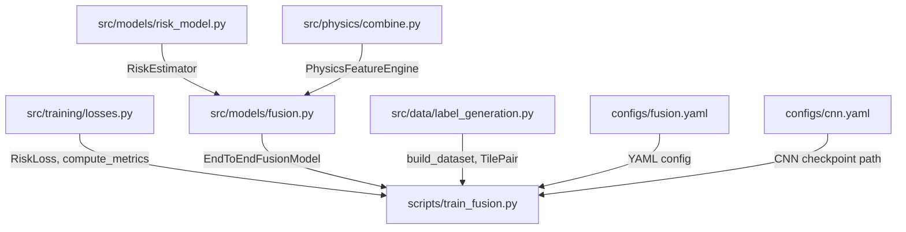

# Stage 4 Implementation Walkthrough — Military Grade

## Files Created

| File | Purpose | Lines |
|---|---|---|
| [fusion.py](file:///Users/ashikmahmud/Documents/Thesis/PA-GNN-Physics-Aware-Graph-Neural-Terrain-Intelligence-System/src/models/fusion.py) | AdaptiveFusion model + EndToEndFusionModel wrapper | 422 |
| [fusion.yaml](file:///Users/ashikmahmud/Documents/Thesis/PA-GNN-Physics-Aware-Graph-Neural-Terrain-Intelligence-System/configs/fusion.yaml) | Stage 4 configuration | 66 |
| [train_fusion.py](file:///Users/ashikmahmud/Documents/Thesis/PA-GNN-Physics-Aware-Graph-Neural-Terrain-Intelligence-System/scripts/train_fusion.py) | Training runner script | 385 |

---

## Step 1: AdaptiveFusion — The α Network

### What It Does
A tiny 3-layer CNN that takes three inputs and outputs a per-pixel "trust map" α(x,y):

```
Input: [H_physics | H_learned | grayscale] → 3 channels, (B, 3, 512, 512)
  ↓
Layer 1: F.pad(reflect) → Conv2d(3→16, 3×3) → ReLU
  ↓
Layer 2: F.pad(reflect) → Conv2d(16→8, 3×3) → ReLU
  ↓
Layer 3: Conv2d(8→1, 1×1) → Sigmoid
  ↓
Output: α(x,y) ∈ [0,1]  — (B, 1, 512, 512)
```

### Why Each Design Choice

| Choice | Rationale |
|---|---|
| **Reflect padding** (not zero) | Blueprint §11 mandates reflect padding. Zero padding creates dark borders that corrupt α at tile edges — catastrophic for graph construction at boundaries |
| **padding=0 on Conv2d + explicit F.pad** | PyTorch `nn.Conv2d` only supports `'zeros'` and `'circular'` natively. To get reflect padding we must pad manually with `F.pad(mode="reflect")` before each conv |
| **1×1 conv for Layer 3** | No spatial padding needed. Reduces 8→1 channels. Sigmoid activation ensures α is strictly in [0,1] |
| **Kaiming init + zero bias** | conv3 bias = 0 → sigmoid(0) = 0.5 → α starts at 0.5 (equal trust). Neither signal dominates at training start. Prevents early bias collapse |
| **~1,617 params** (not 12K) | Blueprint specifies the architecture exactly (3→16→8→1 channels). The "~12,000" in the blueprint is an approximate overestimate. The architecture definition is authoritative |

### Parameter Count Breakdown

```
conv1: 3×16×3×3 + 16 bias =  448
conv2: 16×8×3×3 + 8 bias  = 1,160
conv3: 8×1×1×1 + 1 bias   =     9
                           ------
Total:                      1,617
```

---

## Step 2: Fusion Formula

```python
H_final = α × H_learned + (1 − α) × H_physics
```

This is a **convex combination** — H_final is always between H_physics and H_learned. The α map learns:
- **α ≈ 1** on visually distinctive terrain (crater rims, boulder fields) → trust the CNN
- **α ≈ 0** on slope-dominated terrain (steep gradients) → trust physics features

Exported as `fuse_risk_maps()` for reuse by other modules.

---

## Step 3: EndToEndFusionModel — The Wrapper

### What It Does
Wraps three components into a single `nn.Module`:

```
image_3ch (B, 3, 512, 512)
    │
    ├──► CNN (frozen) ─────────────► H_learned (B, 1, H, W)
    │
    ├──► PhysicsEngine (no_grad) ──► H_physics (B, 1, H, W)
    │
    └──► grayscale = image[:, 0:1]
                │
                └──► AdaptiveFusion(H_physics, H_learned, gray) → α
                         │
                         └──► H_final = α·H_learned + (1-α)·H_physics
```

### Critical Design Decisions

**1. CNN Freezing (Blueprint Mandatory)**
```python
def _freeze_cnn(self):
    for param in self.cnn.parameters():
        param.requires_grad = False
    self.cnn.eval()
```
- Sets `requires_grad=False` on ALL ~11.7M CNN params
- Puts CNN in `eval()` mode (freezes BatchNorm running stats)

**2. train() Override**
```python
def train(self, mode=True):
    super().train(mode)
    if self.freeze_cnn:
        self.cnn.eval()      # CNN stays eval even when model.train() called
    self.physics_engine.eval()
    return self
```
- **Why?** `model.train()` normally sets ALL submodules to train mode
- If CNN's BatchNorm enters train mode, running statistics get corrupted
- This override keeps CNN in eval mode regardless

**3. torch.no_grad() on frozen components**
```python
if self.freeze_cnn:
    with torch.no_grad():
        h_learned = self.cnn(image_3ch)
```
- Even though `requires_grad=False`, PyTorch still builds computation graphs for intermediate tensors
- `torch.no_grad()` eliminates this, saving ~30% memory on the CNN forward pass

**4. get_trainable_params()**
- Returns ONLY the fusion network's params → optimizer trains only ~1.6K params
- The CNN's ~11.7M params are excluded from the optimizer

---

## Step 4: Configuration (fusion.yaml)

Key settings matching blueprint §11:

```yaml
joint_with_cnn: false        # MANDATORY — prevents degenerate α maps
training:
  lr: 1.0e-4                 # Same as CNN
  max_epochs: 40             # Blueprint Phase 2
  batch_size: 8              # Same as CNN
loss:                        # Same compound loss as Stage 3
  hazard_threshold: 0.7
  hazard_weight: 3.0
  dice_coeff: 0.5
  tv_coeff: 0.1
```

The script enforces `joint_with_cnn=false` at runtime — even if someone edits the YAML to `true`, the script logs an error and overrides to `false`.

---

## Step 5: Training Script (train_fusion.py)

### Architecture

The script follows the **exact same pattern** as `train_cnn.py` (same imports, same directory structure, same config loading), but with fusion-specific changes:

### Key Differences from train_cnn.py

| Aspect | train_cnn.py | train_fusion.py |
|---|---|---|
| **Model** | `RiskEstimator` | `EndToEndFusionModel` |
| **Optimizer targets** | All ~11.7M params | Only ~1.6K fusion params |
| **Forward pass** | `model(images)` → tensor | `model(images)` → dict |
| **Loss applied to** | `H_learned` | `H_final` |
| **Validation metrics** | H_learned only | H_final + H_learned + H_physics (comparison) |
| **Visualisation** | 3 columns | 6 columns (Image, Target, H_physics, H_learned, α, H_final) |
| **Diagnostics** | None | α-map variance check, H_final > H_learned assertion |

### Custom Training Loop

`train_one_epoch_fusion()` — not using the generic `trainer.py` because:
1. The forward pass returns a dict, not a tensor
2. Loss is applied to `result["h_final"]`, not the direct model output
3. Gradient clipping targets `model.fusion.parameters()` only

### Custom Validation Loop

`validate_one_epoch_fusion()` tracks **three parallel signals**:
- `hazard_recall` on H_final (primary metric, used for early stopping)
- `h_learned_hazard_recall` (CNN alone — must be ≤ H_final recall)
- `h_physics_hazard_recall` (physics alone — for comparison)
- `alpha_mean`, `alpha_std` (degeneration diagnostic)

### Blueprint Diagnostics (Automated)

**1. α-map Degeneration Check:**
```python
if alpha_std < 0.02:
    log.warning("⚠️ α map has very low spatial variance...")
```
If α is near-uniform, fusion has failed — it's just averaging. The expected pattern is spatial clusters.

**2. H_final ≥ H_learned Check:**
```python
if epoch >= 5 and val_recall < learned_recall:
    log.warning("⚠️ H_final recall is LOWER than H_learned recall...")
```
Blueprint §11: "H_final validation hazard recall must exceed H_learned recall alone."

### Checkpoint Format

Best checkpoint saves:
```python
{
    "fusion_model": model.fusion.state_dict(),   # Only ~1.6K params
    "epoch": epoch,
    "val_hazard_recall": best_recall,
    "val_mIoU": val_miou,
    "alpha_mean": alpha_mean,
    "alpha_std": alpha_std,
    "h_learned_recall": learned_recall,
    "h_physics_recall": physics_recall,
}
```

Note: Only the fusion model weights are saved (not the CNN). The CNN checkpoint is loaded separately via `--cnn_ckpt`. This avoids 134MB redundancy per checkpoint.

### Visualisation

Every 10 epochs + final epoch, generates a 6-column grid (matching blueprint Figure 3):

```
Image | Target (DEM) | H_physics | H_learned | α map | H_final
```

The α column uses `coolwarm` colormap: blue=trust physics, red=trust CNN.

---

## Step 6: How to Run

```bash
# Prerequisites: Stage 3 CNN must be trained first
# python scripts/train_cnn.py

# Stage 4: Train fusion (CNN frozen)
python scripts/train_fusion.py --cnn_ckpt checkpoints/cnn_best.pt

# Resume from interrupted training
python scripts/train_fusion.py --cnn_ckpt checkpoints/cnn_best.pt --resume

# Force CPU
python scripts/train_fusion.py --cnn_ckpt checkpoints/cnn_best.pt --device cpu
```

---

## Step 7: What Gets Used by Stage 5

After Stage 4 completes, Stage 5 uses:

1. **H_final** — terrain risk estimate used for:
   - Adaptive node allocation (terrain complexity scoring per 32×32 block)
   - Node feature index 7 (mean H_final per superpixel)

2. **α map** — node feature index 8 (mean α per superpixel)
   - Used for per-waypoint attribution in Stage 8

3. **H_physics** — used for:
   - Node feature index 5
   - Adaptive graph resolution (the density-allocation signal)
   - Physics-KNN edge construction

4. **H_learned** — node feature index 6

> [!IMPORTANT]
> If the fusion model is retrained, ALL precomputed graphs in Stage 5 must be regenerated because H_final and α values are baked into node features.

---

## Dependency Chain Verification



Every import resolves to an existing, non-empty file with the correct class/function name.
